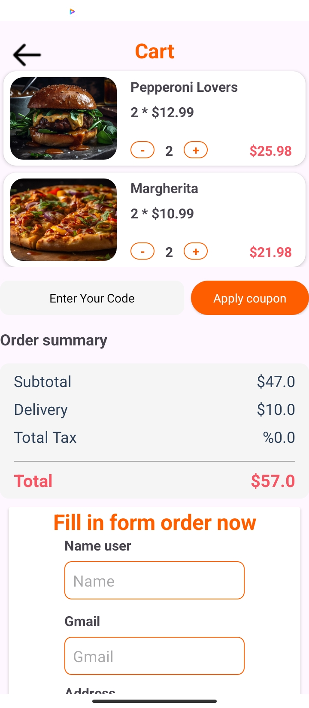
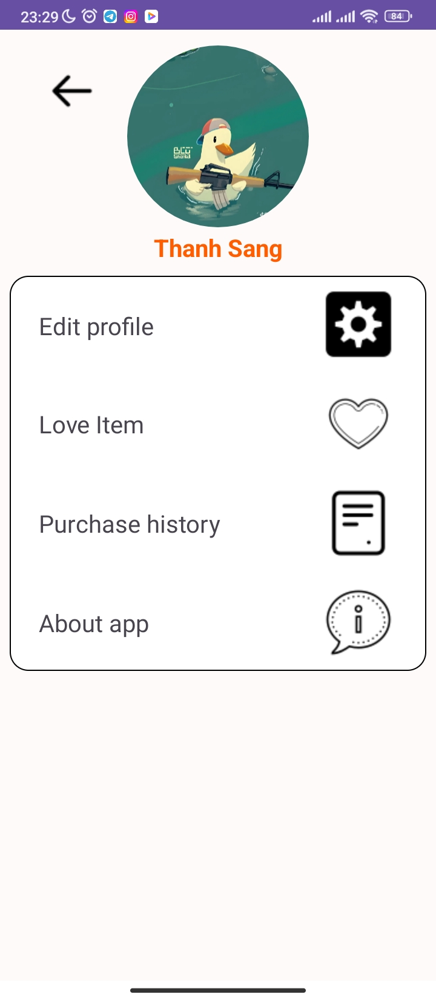
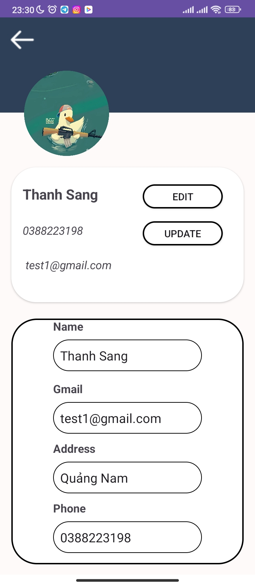
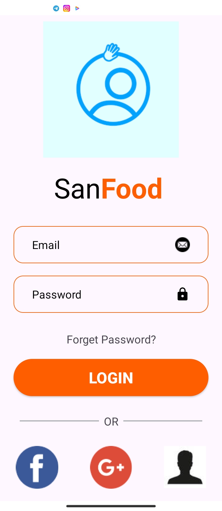
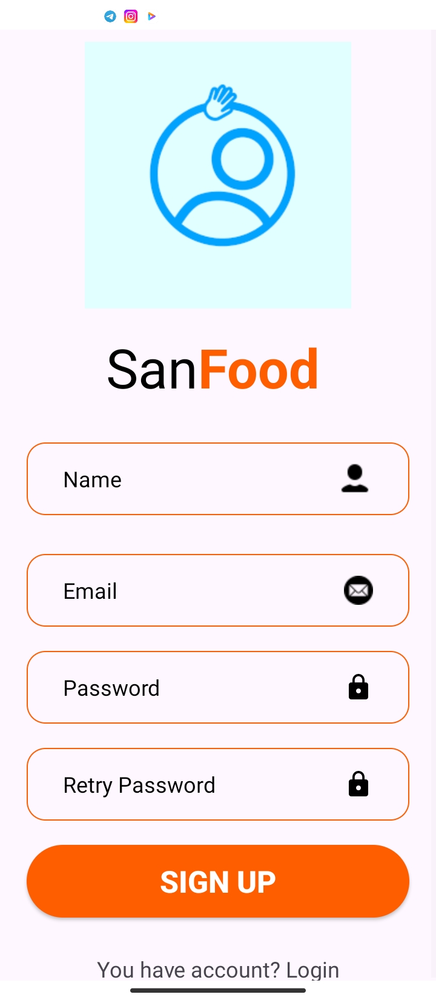

# Food App README

## Introduction

Welcome to Food App! This Java-based application utilizes XML for user interface design. Food App connects users with food suppliers, providing a convenient shopping and ordering experience. It includes intelligent features such as a Wit.AI-powered chatbot and admin management.

## Features

1. **Product Search**
   - Users can easily search for food products by name, category, or keywords.
   - Clear search results help users quickly find what they need.

2. **Ordering**
   - Food App allows users to order food products from suppliers.
   - The ordering process is simple and straightforward, including cart review, payment method selection, and order confirmation.

3. **Smart Chatbot**
   - Using Wit.AI AI technology, the chatbot in Food App interacts and addresses user queries.
   - The chatbot provides product information, assists with ordering issues, and supports customer service.

4. **Admin Management**
   - Admin can manage product listings, orders, and user information.
   - An easy-to-use interface enables efficient addition, modification, and deletion of information.

5. **User Profile Management**
   - Users can manage personal information, delivery addresses, and purchase history.
   - Editing and updating information is straightforward from the user interface.

## Installation and Deployment

### System Requirements
- Android Studio version X.X.X or higher.
- JDK version X.X or higher.
- Install Firebase and configure your project in Firebase Console.

### Deployment
1. **Clone the Repository:**

2. **Open Project in Android Studio:**
- Import the project into Android Studio.
- Configure Firebase for your project (refer to Firebase documentation).

3. **Configure Wit.AI API:**
- Register and obtain API key from Wit.AI.
- Configure the source code to connect with the chatbot.

4. **Build and Run the Application:**
- Build and run the application on an emulator or physical device.

## Contributions and Feedback
If you have any suggestions or bug reports, please open an issue on our GitHub repository. We welcome contributions from the community to improve Food App.

## Image of application

## Author
Food App is developed by [Your Company/Developer], with support from the open-source community and cutting-edge technologies.

Thank you for your interest in and usage of Food App. We hope you have an enjoyable and convenient shopping experience! 🍲📱
